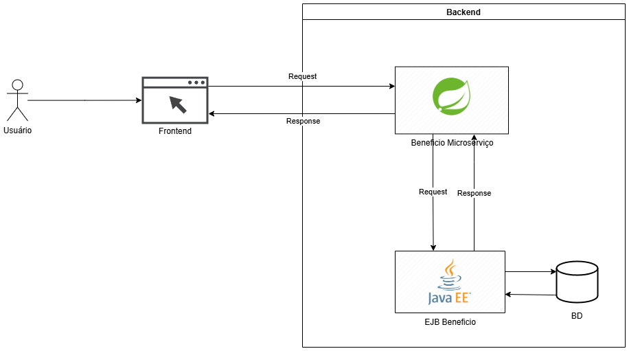

Olá, como vai?

O desafio foi interessante. Eu comecei analisando as tarefas e fiz um esboço da arquitetura que no meu entendimento ficou assim:

O serviço EJB se comunica com o banco de dados, o spring boot faz a intermediação, aqui poderiamos ter um banco auxiliar noSQL de logs por exemplo, essa implementação não contempla.

Depois disso fui para a implementação do codigo, no EJB utilizei Jakarta EE porém não usei as implementações modernas de Repository e sim o padrão DAO, com typed queries, usando diretiva de Transaction e o @Version para assegurar Optimistic Lock.

No backend usei o OpenFeign para a comunicação com as APIs do EJB, poderia usar o Kafka mas assumi que esse serviço é de pouco acesso e o acesso via REST poderia ser o mais adequado nesse contexto

No front end usei o angular 20 LTS com a abordagem relativamente nova signals junto com um framework css chamado bulma que é bem leve e bonito.

Acredito que com mais tempo poderia fazer mais melhorias, espero que gostem.  

Abraço.
